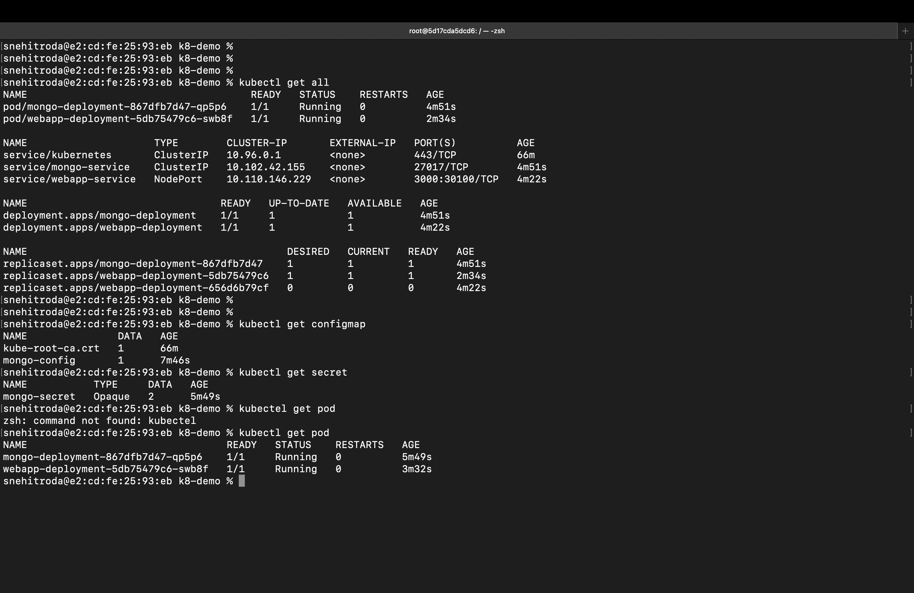
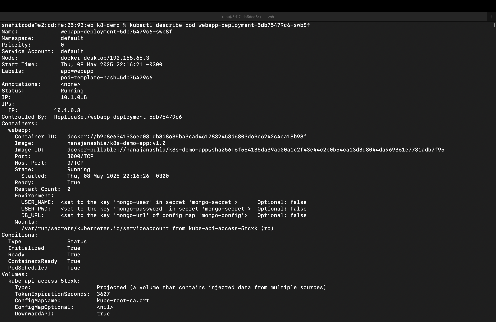

# Kubernetes Deployment Demo Project 

The project sets up a basic web application connected to a MongoDB database using Kubernetes. It includes deployments, services, a ConfigMap, and a Secret for secure environment configuration.

---

## 🗂️ Project Structure

- `mongo-config.yaml`: ConfigMap storing MongoDB URL.
- `mongo-secret.yaml`: Kubernetes Secret for MongoDB credentials.
- `mongo.yaml`: Deployment and Service for MongoDB.
- `webapp.yaml`: Deployment and NodePort Service for a sample web application.

## Kubernetes Get All Output



---

## K8 Describe Pod Output



---

## ⚙️ Setup Instructions

### 1. Apply Kubernetes Configurations

Ensure your `kubectl` context is set to the right cluster.

```bash
kubectl apply -f mongo-config.yaml
kubectl apply -f mongo-secret.yaml
kubectl apply -f mongo.yaml
kubectl apply -f webapp.yaml

